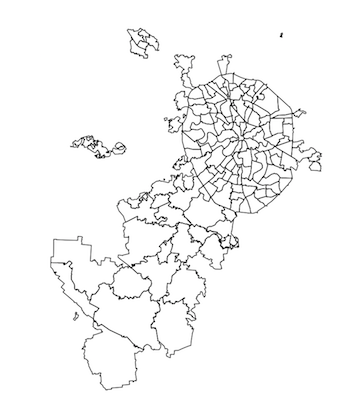
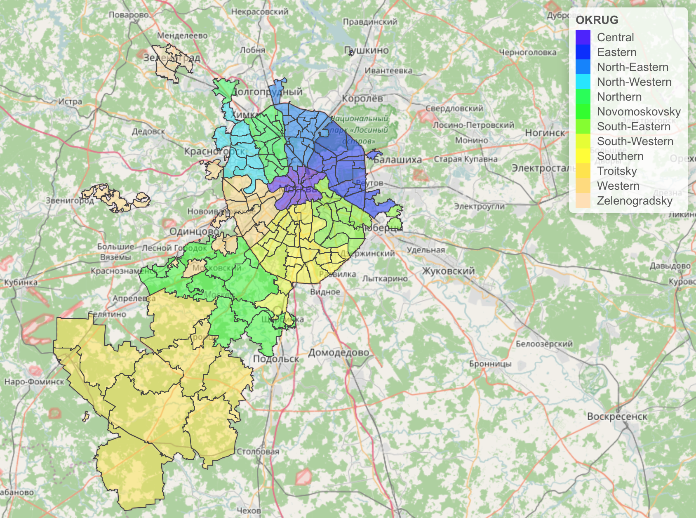
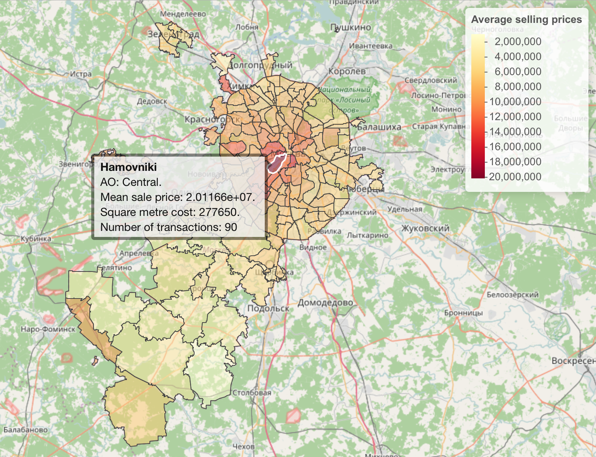

# Kaggle_Sberbank-RHM

Hello everyone!


<a href="url"></a>
The shapefile data [shp_mo](shp_mo) has been found here: [http://gis-lab.info/qa/moscow-atd.html](http://gis-lab.info/qa/moscow-atd.html).  
(This is the second **ESRI shape** file)


The federal city of Moscow, Russia is divided into twelve administrative okrugs, which are in turn subdivided into districts (raions). [(source Wikipedia)](https://en.wikipedia.org/wiki/Administrative_divisions_of_Moscow)  
There are 146 raions, which are the 146 different **sub_area** in the kaggle datasets.

The issue are the raion names... Those from Kaggle (**sub_area**) are in English while those on the shapefile (**NAME**) are in Russian.

I have created a [csv-dictionnary](NAME_to_subarea.csv) which matches everything. 😎

If you want, I already joined both here: [shp_mo_kag_SRHM.R](shp_mo_kag_SRHM.R).  
And you can find the new shapefile here: [shp_mo_kag_SRHM](shp_mo_kag_SRHM)  
Or directly an R SpatialPolygonsDataFrame object here: [mo_SPD.rds](mo_SPD) that you can read:
```R
library(sp)
mo <- readRDS(file = "shp.rds")
```

I hope this shapefile would help you for the competition. You can for example, easily get the longitude/latitude of the polygons.  

Or maybe you just want to plot some beautiful maps 🇷🇺!

I've just started a  [notebook](http://perso.jordantremoureux.fr/Kaggle/kaggle.nb.html).  

Here are some screenshots of the leaflet visualizations:

```R
factpal <- colorFactor(topo.colors(12), mo@data$OKRUG)

labels <- sprintf(
  "<strong>%s</strong><br/>AO: %s",
  mo@data$sub_area, mo@data$OKRUG
) %>% lapply(htmltools::HTML)


OKRUGS <- leaflet(mo) %>%
  addTiles() %>%
  addPolygons(color = "#444444", weight = 1, smoothFactor = 0.5,
              opacity = 1.0, fillOpacity = 0.5,
              fillColor = ~factpal(OKRUG),
              highlightOptions = highlightOptions(color = "white", weight = 2,
                                                  bringToFront = TRUE),
              label = labels,
              labelOptions = labelOptions(
                style = list("font-weight" = "normal", padding = "3px 8px"),
                textsize = "15px",
                direction = "auto")) %>%
  addLegend(pal = factpal, values = ~OKRUG, opacity = 1)
OKRUGS
```




